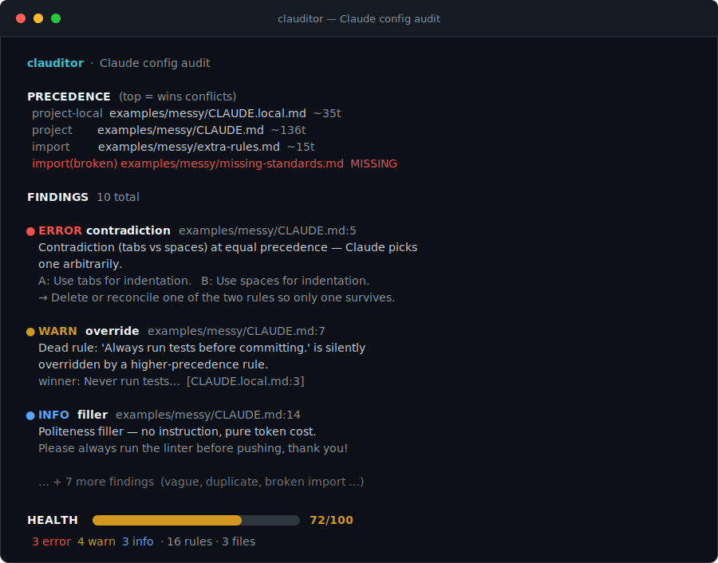

<div align="center">

# clauditor

### The linter for your `CLAUDE.md`.

**clauditor audits your whole Claude Code instruction stack and shows you which rules are dead, contradictory, vague, duplicated, or just burning tokens — in one command, fully local.**

[](https://github.com/ingridtoulotte/clauditor/actions/workflows/ci.yml)
[](LICENSE)


[](CONTRIBUTING.md)
[](https://github.com/ingridtoulotte/clauditor/stargazers)

<br/>



<sub><i>One command. Your entire instruction stack — every <code>CLAUDE.md</code>, <code>.claude/rules</code>, and <code>@import</code> — audited and scored.</i></sub>

</div>

---

## Try it in 30 seconds

```bash
pipx install git+https://github.com/ingridtoulotte/clauditor
clauditor                 # audits the current project + your ~/.claude
```

No pipx? Either works just as well:

```bash
pip install git+https://github.com/ingridtoulotte/clauditor && clauditor
# or, zero-install:
git clone https://github.com/ingridtoulotte/clauditor && cd clauditor && python -m clauditor examples/messy
```

Pure Python standard library. **Zero dependencies. Zero network calls. Your config never leaves your machine.**

---

## Why this exists

You write rules in `CLAUDE.md`. Claude reads them. And then it… does its own thing anyway.

You're not imagining it. It's one of the most-reported pain points in Claude Code
([#27032](https://github.com/anthropics/claude-code/issues/27032),
[#15443](https://github.com/anthropics/claude-code/issues/15443),
[#7777](https://github.com/anthropics/claude-code/issues/7777)),
and Anthropic's own docs admit that **when two rules conflict, Claude may pick one arbitrarily** — there's no guarantee which one wins.

The catch: your rules don't live in one file. They're scattered across a *stack* —
enterprise policy, `CLAUDE.local.md`, every `CLAUDE.md` from your cwd up to the repo
root, `.claude/rules/*.md`, your global `~/.claude/CLAUDE.md`, and any `@`-imports.
They get **merged**, not cleanly overridden. So you end up with rules that contradict
each other, rules that a higher layer silently kills, vague rules Claude can't act on,
and copies of the same rule three times — all loaded into context on *every single turn*.

`/memory` and `/doctor` tell you what *loaded*. **clauditor tells you what's actually broken.**

> One developer [audited every rule in their `CLAUDE.md`](https://sabahudinmurtic.substack.com/p/i-audited-every-rule-in-my-claudemd) by hand — and found **half of them failed**. clauditor does that audit in a second, across the whole stack.

---

## See it on a real mess

Point clauditor at a folder. It reconstructs the precedence order Claude actually
uses, then flags every rule that won't survive contact with it:

```diff
  examples/messy/CLAUDE.md
- - Use tabs for indentation.
- - Use spaces for indentation.          🔴 contradiction — same tier, Claude coin-flips
- - Always run tests before committing.   🟡 dead — your CLAUDE.local.md says "never"
- - Try to keep functions small...        🟡 vague — Claude can't verify it complied
- - ...commit messages. (line 8)
- - ...commit messages. (line 9)          🔵 duplicate — billed twice, every turn
- - Please run the linter, thank you!     🔵 filler — costs tokens, says nothing
- - @./missing-standards.md               🔴 broken import — a whole file never loads
```

Six of those eight lines were doing nothing — or worse. **You can't fix what you can't see.**

---

## What it checks

| Check | | Catches |
|---|---|---|
| **contradiction** | 🔴 | Two rules clash at the **same** precedence — Claude resolves them by coin-flip |
| **override** | 🟡 | A rule is **silently overridden** by a higher layer → it's *dead*, but still costs tokens (the real "Claude ignores my CLAUDE.md") |
| **vague** | 🟡 | Weasel phrasing (`try to`, `if possible`, `generally`) Claude can't verify it followed |
| **duplicate** | 🔵 | The same rule, twice — wasted budget, future drift |
| **imports** | 🔴 | Broken or cyclic `@import` — a whole block of rules that never loads |
| **bloat** | 🟡 | Oversized global file / file / total budget, loaded every turn |
| **filler** | 🔵 | Politeness and meta-narration ("please", "this file describes…") |

Every finding comes with the exact `path:line` and a concrete fix. Full details and how
precedence weights are computed: **[docs/checks.md](docs/checks.md)**.

---

## Five outputs, one engine

```bash
clauditor                            # colored terminal report (the screenshot above)
clauditor --format json              # machine-readable, for scripts and dashboards
clauditor --format md -o report.md   # drop a Markdown report into a PR
clauditor --format sarif             # GitHub code-scanning annotations (see below)
clauditor --format badge             # live "config health" badge for your README
clauditor --min-severity warn        # hide the 🔵 info noise
clauditor --no-user                  # audit only the project, skip ~/.claude
clauditor --list-checks              # see every check
```

### 🛡️ Inline PR annotations (SARIF)

clauditor speaks **SARIF 2.1.0**, so every dead or contradictory rule shows up as a
review annotation right on the line in your PR's *Files changed* tab — same place you'd
see an ESLint or CodeQL alert.

```yaml
# .github/workflows/clauditor.yml
name: clauditor
on: [pull_request]
permissions:
  contents: read
  security-events: write          # required to upload SARIF
jobs:
  audit:
    runs-on: ubuntu-latest
    steps:
      - uses: actions/checkout@v5
      - uses: ingridtoulotte/clauditor@v0.2.0
        with:
          args: --sarif --ci -o clauditor.sarif   # annotate AND fail on 🔴
      - uses: github/codeql-action/upload-sarif@v3
        if: always()
        with:
          sarif_file: clauditor.sarif
```

Prefer a plain gate? The Action defaults to `--ci`:

```yaml
      - uses: ingridtoulotte/clauditor@v0.2.0
        with:
          args: --ci --strict   # exit 1 on contradictions (and warnings, with --strict)
```

Or call the CLI directly anywhere:

```bash
clauditor --ci            # exit 1 if any 🔴 error exists
clauditor --ci --strict   # exit 1 on 🟡 warnings too
```

### 🩺 A live config-health badge

`--format badge` emits a [shields.io endpoint](https://shields.io/badges/endpoint-badge).
Generate it in CI, commit the JSON, and put your config's health right in your README:

```bash
clauditor --format badge -o .clauditor-badge.json
```

```md

```

→  &nbsp; (green ≥ 80, yellow ≥ 50, red below)

---

## How it compares

| | what loaded | conflicts | dead/overridden rules | vague rules | whole stack | local-only | CI gate | PR annotations |
|---|:---:|:---:|:---:|:---:|:---:|:---:|:---:|:---:|
| `/memory`, `/doctor` (built-in) | ✅ | ❌ | ❌ | ❌ | ⚠️ order only | ✅ | ❌ | ❌ |
| `claude-md-improver` (skill) | — | ⚠️ | ❌ | ✅ | ❌ misses `.claude/rules` | ✅ | ❌ | ❌ |
| token / context optimizers | — | ❌ | ❌ | ❌ | ⚠️ tokens only | ✅ | ❌ | ❌ |
| **clauditor** | ✅ | ✅ | ✅ | ✅ | ✅ | ✅ | ✅ | ✅ |

clauditor isn't a token counter and it isn't a memory tool — it's the **linter** for the
instructions you've already written. It pairs well with everything above.

---

## Roadmap

- [x] SARIF output for GitHub code-scanning annotations
- [x] Live config-health badge endpoint
- [ ] `--fix` mode that proposes concrete edits (remove dead rules, merge dupes)
- [ ] `--watch` mode that re-audits on save
- [ ] Cross-tool support: `AGENTS.md`, Cursor `.mdc`, Copilot instructions
- [ ] A `pre-commit` hook
- [ ] Community pack of high-precision antonym/weasel rules

Ideas and PRs very welcome — see below.

## Contributing

A new check is **one file**. The whole contract is in
[CONTRIBUTING.md](CONTRIBUTING.md), and [`good first issue`](https://github.com/ingridtoulotte/clauditor/labels/good%20first%20issue)
issues are a great place to start (more antonym pairs, more weasel phrases, a `--watch` mode…).

```bash
git clone https://github.com/ingridtoulotte/clauditor && cd clauditor
pip install -e .
clauditor --selftest      # 42 assertions, hermetic, no network
python -m unittest discover -s tests -v
```

## FAQ

**Does it send my config anywhere?** No. clauditor is pure stdlib and makes zero network
calls. It only reads files you point it at.

**Will it edit my files?** Not in v0.2. It only reports. (`--fix` is on the roadmap and
will be opt-in.)

**Are the token counts exact?** They're a stable proxy (~4 chars/token), good for comparing
files and watching a budget — not for billing.

**Does the health score mean anything absolute?** It's a relative signal: 100 minus a
penalty per finding (🔴 −6, 🟡 −2, 🔵 −0.5). Use it to trend your own config over time,
not to compare against someone else's.

**How does it know the precedence?** It mirrors Claude Code's documented hierarchy:
enterprise → `CLAUDE.local.md` → project `CLAUDE.md` chain → `.claude/rules` → `~/.claude`.
`@`-imports inherit their importer's weight. Details in [docs/checks.md](docs/checks.md).

---

<div align="center">

If clauditor found a dead rule in your config, **drop a ⭐** — it helps other people find it.

MIT © [Ingrid Toulotte](https://github.com/ingridtoulotte) · [Changelog](CHANGELOG.md) · [Checks reference](docs/checks.md)

</div>
